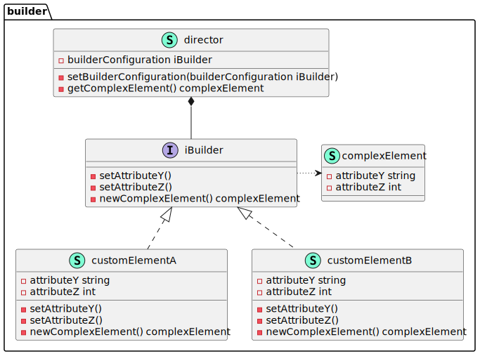

# go-dsgn-pttrn-builder

> A Go implementation of the builder design pattern.

A flexible solution to complex object creation problems. The aim is to separate the construction of a complicated object from its representation, enabling the same construction process to create different representations.

&nbsp;

  

